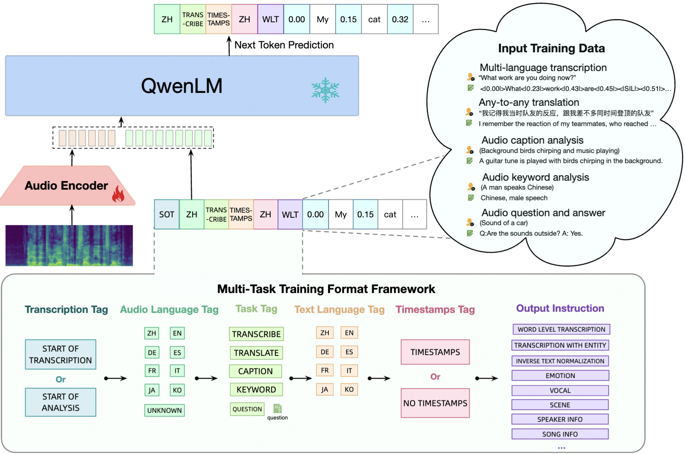
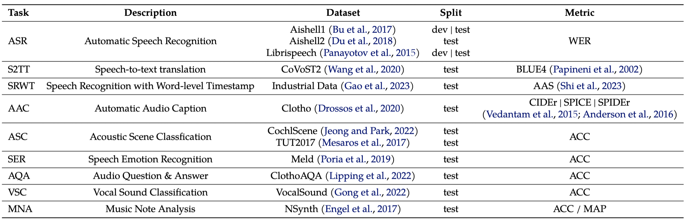
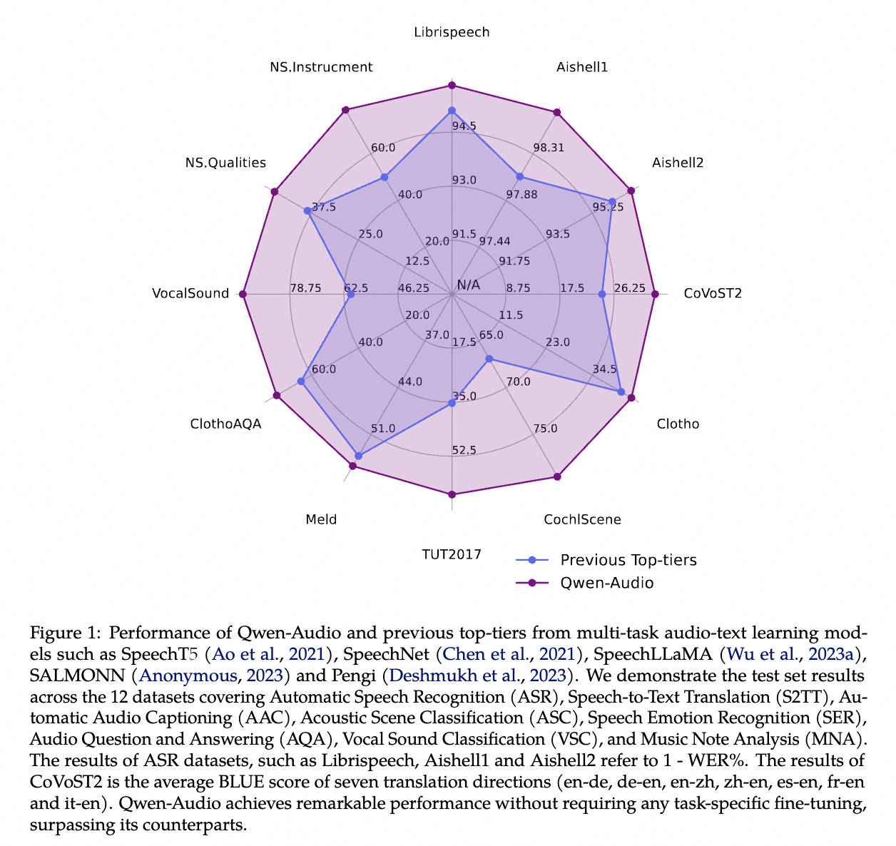

<p align="left">
        <a href="README_CN.md">中文</a> &nbsp｜ &nbsp English&nbsp&nbsp
</p>
<br><br>


<p align="center">
    
<p>
<br>

<p align="center">
        Qwen-Audio <a href="https://www.modelscope.cn/models/qwen/QWen-Audio/summary">🤖 <a> | <a href="https://huggingface.co/Qwen/Qwen-Audio">🤗</a>&nbsp ｜ Qwen-Audio-Chat <a href="https://www.modelscope.cn/models/qwen/QWen-Audio-Chat/summary">🤖 <a>| <a href="https://huggingface.co/Qwen/Qwen-Audio-Chat">🤗</a>&nbsp | &nbsp&nbsp Demo<a href="https://modelscope.cn/studios/qwen/Qwen-Audio-Chat-Demo/summary"> 🤖</a> | <a href="https://huggingface.co/spaces/Qwen/Qwen-Audio">🤗</a>&nbsp
<br>
&nbsp&nbsp<a href="https://qwen-audio.github.io/Qwen-Audio/">Homepage</a>&nbsp ｜ &nbsp&nbsp<a href="http://arxiv.org/abs/2311.07919">Paper</a>&nbsp&nbsp | &nbsp&nbsp&nbsp<a href="https://github.com/QwenLM/Qwen/blob/main/assets/wechat.png">WeChat</a>&nbsp&nbsp | &nbsp&nbsp<a href="https://discord.gg/CV4E9rpNSD">Discord</a>&nbsp&nbsp</a>
</p>
<br><br>

[](https://paperswithcode.com/sota/speech-recognition-on-aishell-1?p=qwen-audio-advancing-universal-audio)
[](https://paperswithcode.com/sota/speech-recognition-on-aishell-2-test-android-1?p=qwen-audio-advancing-universal-audio)
[](https://paperswithcode.com/sota/speech-recognition-on-aishell-2-test-ios?p=qwen-audio-advancing-universal-audio)
[](https://paperswithcode.com/sota/speech-recognition-on-aishell-2-test-mic-1?p=qwen-audio-advancing-universal-audio)
[](https://paperswithcode.com/sota/acoustic-scene-classification-on-cochlscene?p=qwen-audio-advancing-universal-audio)
[](https://paperswithcode.com/sota/acoustic-scene-classification-on-tut-acoustic?p=qwen-audio-advancing-universal-audio) <br>
[](https://paperswithcode.com/sota/audio-classification-on-vocalsound?p=qwen-audio-advancing-universal-audio) <br>
[](https://paperswithcode.com/sota/audio-captioning-on-clotho?p=qwen-audio-advancing-universal-audio) <br>
[](https://paperswithcode.com/sota/speech-recognition-on-librispeech-test-clean?p=qwen-audio-advancing-universal-audio)
[](https://paperswithcode.com/sota/emotion-recognition-in-conversation-on-meld?p=qwen-audio-advancing-universal-audio)
[](https://paperswithcode.com/sota/speech-recognition-on-librispeech-test-other?p=qwen-audio-advancing-universal-audio)

**Qwen-Audio** (Qwen Large Audio Language Model) is the multimodal version of the large model series, Qwen (abbr. Tongyi Qianwen), proposed by Alibaba Cloud. Qwen-Audio accepts diverse audio (human speech, natural sound, music and song) and text as inputs, outputs text. The contribution of Qwen-Audio include:

- **Fundamental audio models**: Qwen-Audio is a fundamental multi-task audio-language model that supports various tasks, languages, and audio types, serving as a universal audio understanding model. Building upon Qwen-Audio, we develop Qwen-Audio-Chat through instruction fine-tuning, enabling multi-turn dialogues and supporting diverse audio-oriented scenarios.
- **Multi-task learning framework for all types of audios**: To scale up audio-language pre-training, we address the challenge of variation in textual labels associated with different datasets by proposing a multi-task training framework, enabling knowledge sharing and avoiding one-to-many interference. Our model incorporates more than 30 tasks and extensive experiments show the model achieves strong performance.
- **Strong Performance**: Experimental results show that Qwen-Audio achieves impressive performance across diverse benchmark tasks without requiring any task-specific fine-tuning, surpassing its counterparts. Specifically, Qwen-Audio achieves state-of-the-art results on the test set of Aishell1, cochlscene, ClothoAQA, and VocalSound.
- **Flexible multi-run chat from audio and text input**: Qwen-Audio supports multiple-audio analysis, sound understanding and reasoning, music appreciation, and tool usage.

<br>
<p align="center">
    
<p>
<br>


We release two models of the Qwen-Audio series soon:

- Qwen-Audio: The pre-trained multi-task audio understanding model uses Qwen-7B as the initialization of the LLM, and [Whisper-large-v2](https://github.com/openai/whisper) as the initialization of the audio encoder.
- Qwen-Audio-Chat: A multimodal LLM-based AI assistant, which is trained with alignment techniques. Qwen-Audio-Chat supports more flexible interaction, such as multiple audio inputs, multi-round question answering, and creative capabilities.
<br>

## News and Updates
* 2023.11.30 🔥 We have released the checkpoints of both **Qwen-Audio** and **Qwen-Audio-Chat** on ModelScope and Hugging Face.
* 2023.11.15 🎉 We released a [paper](http://arxiv.org/abs/2311.07919) for details about Qwen-Audio and Qwen-Audio-Chat model, including training details and model performance.

<br>

## Evaluation
We evaluated the Qwen-Audio's abilities on 12 standard benchmarks as follows:
<p align="center">
    
<p>


The below is the overal performance：
<p align="center">
    
<p>


The details of evaluation are as follows:
### Automatic Speech Recognition
<table>
<thead>
<tr>
    <th rowspan="2">Dataset</th>
    <th rowspan="2">Model</th>
    <th colspan="4">Results (WER)</th>
  </tr>
<tr>
    <th>dev-clean</th>
    <th>dev-othoer</th>
    <th>test-clean</th>
    <th>test-other</th>
  </tr>
</thead>

<tbody align="center">
<tr>
    <td rowspan="5">Librispeech</td>
    <td>SpeechT5</td>
    <td>2.1</td>
    <td>5.5</td>
    <td>2.4</td>
    <td>5.8</td>
  </tr>
  <tr>
    <td>SpeechNet</td>
    <td>-</td>
    <td>-</td>
    <td>30.7</td>
    <td>-</td>
  </tr>
<tr>
    <td>SLM-FT</td>
    <td>-</td>
    <td>-</td>
    <td>2.6</td>
    <td>5.0</td>
  </tr>
<tr>
    <td>SALMONN</td>
    <td>-</td>
    <td>-</td>
    <td>2.1</td>
    <td>4.9</td>
  </tr>
<tr>
    <td>Qwen-Audio</td>
    <td><strong>1.8</strong></td>
    <td><strong>4.0</strong></td>
    <td><strong>2.0</strong></td>
    <td><strong>4.2</strong></td>
  </tr>
</table>


<table>
<thead>
<tr>
    <th rowspan="2">Dataset</th>
    <th rowspan="2">Model</th>
    <th colspan="2">Results (WER)</th>
  </tr>
<tr>
    <th>dev</th>
    <th>test</th>
  </tr>
</thead>

<tbody align="center">
<tr>
    <td rowspan="4">Aishell1</td>
    <td>MMSpeech-base</td>
    <td>2.0</td>
    <td>2.1</td>
  </tr>
<tr>
    <td>MMSpeech-large</td>
    <td>1.6</td>
    <td>1.9</td>
  </tr>
<tr>
    <td>Paraformer-large</td>
    <td>-</td>
    <td>2.0</td>
  </tr>
<tr>
    <td>Qwen-Audio</td>
    <td><strong>1.2 (SOTA)</strong></td>
    <td><strong>1.3 (SOTA)</strong></td>
  </tr>
</table>


<table>
<thead>
<tr>
    <th rowspan="2">Dataset</th>
    <th rowspan="2">Model</th>
    <th colspan="3">Results (WER)</th>
  </tr>
<tr>
    <th>Mic</th>
    <th>iOS</th>
    <th>Android</th>
  </tr>
</thead>

<tbody align="center">
<tr>
    <td rowspan="3">Aishell2</td>
    <td>MMSpeech-base</td>
    <td>4.5</td>
    <td>3.9</td>
    <td>4.0</td>
  </tr>
<tr>
    <td>Paraformer-large</td>
    <td>-</td>
    <td><strong>2.9</strong></td>
    <td>-</td>
  </tr>
<tr>
    <td>Qwen-Audio</td>
    <td><strong>3.3</strong></td>
    <td>3.1</td>
    <td><strong>3.3</strong></td>
  </tr>
</table>

### Soeech-to-text Translation
<table>
<thead>
<tr>
    <th rowspan="2">Dataset</th>
    <th rowspan="2">Model</th>
    <th colspan="7">Results （BLUE)</th>
  </tr>
<tr>
    <th>en-de</th>
    <th>de-en</th>
    <th>en-zh</th>
    <th>zh-en</th>
    <th>es-en</th>
    <th>fr-en</th>
    <th>it-en</th>
  </tr>
</thead>

<tbody align="center">
<tr>
    <td rowspan="4">CoVoST2</td>
    <td>SALMMON</td>
    <td>18.6</td>
    <td>-</td>
    <td>33.1</td>
    <td>-</td>
    <td>-</td>
    <td>-</td>
    <td>-</td>
  </tr>
<tr>
    <td>SpeechLLaMA</td>
    <td>-</td>
    <td>27.1</td>
    <td>-</td>
    <td>12.3</td>
    <td>27.9</td>
    <td>25.2</td>
    <td>25.9</td>
  </tr>
<tr>
    <td>BLSP</td>
    <td>14.1</td>
    <td>-</td>
    <td>-</td>
    <td>-</td>
    <td>-</td>
    <td>-</td>
    <td>-</td>
  </tr>
<tr>
    <td>Qwen-Audio</td>
    <td><strong>25.1</strong></td>
    <td><strong>33.9</strong></td>
    <td><strong>41.5</strong></td>
    <td><strong>15.7</strong></td>
    <td><strong>39.7</strong></td>
    <td><strong>38.5</strong></td>
    <td><strong>36.0</strong></td>
  </tr>
</table>

### Automatic Audio Caption

<table>
<thead>
<tr>
    <th rowspan="2">Dataset</th>
    <th rowspan="2">Model</th>
    <th colspan="3">Results</th>
  </tr>
<tr>
    <th>CIDER</th>
    <th>SPICE</th>
    <th>SPIDEr</th>
  </tr>
</thead>

<tbody align="center">
<tr>
    <td rowspan="2">Clotho</td>
    <td>Pengi</td>
    <td>0.416</td>
    <td>0.126</td>
    <td>0.271</td>
  </tr>
<tr>
    <td>Qwen-Audio</td>
    <td><strong>0.441</strong></td>
    <td><strong>0.136</strong></td>
    <td><strong>0.288</strong></td>
  </tr>
</table>


### Speech Recognition with Word-level Timestamp
<table>
<thead>
<tr>
    <th rowspan="1">Dataset</th>
    <th rowspan="1">Model</th>
    <th colspan="1">AAC (ms)</th>
  </tr>
</thead>

<tbody align="center">
<tr>
    <td rowspan="3">Industrial Data</td>
    <td>Force-aligner</td>
    <td>60.3</td>
  </tr>
<tr>
    <td>Paraformer-large-TP</td>
    <td>65.3</td>
  </tr>
<tr>
    <td>Qwen-Audio</td>
    <td><strong>51.5 (SOTA)</strong></td>
  </tr>
</table>


### Automatic Scene Classification
<table>
<thead>
<tr>
    <th rowspan="1">Dataset</th>
    <th rowspan="1">Model</th>
    <th colspan="1">ACC</th>
  </tr>
</thead>

<tbody align="center">
<tr>
    <td rowspan="2">Cochlscene</td>
    <td>Cochlscene</td>
    <td>0.669</td>
  </tr>
<tr>
    <td>Qwen-Audio</td>
    <td><strong>0.795 (SOTA)</strong></td>
  </tr>
<tr>
    <td rowspan="2">TUT2017</td>
    <td>Pengi</td>
    <td>0.353</td>
  </tr>
<tr>
    <td>Qwen-Audio</td>
    <td><strong>0.649</strong></td>
  </tr>
</table>


### Speech Emotion Recognition
<table>
<thead>
<tr>
    <th rowspan="1">Dataset</th>
    <th rowspan="1">Model</th>
    <th colspan="1">ACC</th>
  </tr>
</thead>

<tbody align="center">
<tr>
    <td rowspan="2">Meld</td>
    <td>WavLM-large</td>
    <td>0.542</td>
  </tr>
<tr>
    <td>Qwen-Audio</td>
    <td><strong>0.557</strong></td>
  </tr>
</table>


### Audio Question & Answer
<table>
<thead>
<tr>
    <th rowspan="2">Dataset</th>
    <th rowspan="2">Model</th>
    <th colspan="2">Results</th>
  </tr>
<tr>
    <th>ACC</th>
    <th>ACC (binary)</th>
  </tr>
</thead>

<tbody align="center">
<tr>
    <td rowspan="3">ClothoAQA</td>
    <td>ClothoAQA</td>
    <td>0.542</td>
    <td>0.627</td>
  </tr>
<tr>
    <td>Pengi</td>
    <td>-</td>
    <td>0.645</td>
  </tr>
<tr>
    <td>Qwen-Audio</td>
    <td><strong>0.579</strong></td>
    <td><strong>0.749</strong></td>
  </tr>
</table>

### Vocal Sound Classification

<table>
<thead>
<tr>
    <th rowspan="1">Dataset</th>
    <th rowspan="1">Model</th>
    <th colspan="1">ACC</th>
  </tr>
</thead>

<tbody align="center">
<tr>
    <td rowspan="3">VocalSound</td>
    <td>CLAP</td>
    <td>0.4945</td>
  </tr>
<tr>
    <td>Pengi</td>
    <td>0.6035</td>
  </tr>
<tr>
    <td>Qwen-Audio</td>
    <td><strong>0.9289 (SOTA)</strong></td>
  </tr>
</table>


### Music Note Analysis
<table>
<thead>
<tr>
    <th rowspan="1">Dataset</th>
    <th rowspan="1">Model</th>
    <th colspan="1">NS. Qualities (MAP)</th>
<th colspan="1">NS. Instrument (ACC)</th>
  </tr>
</thead>

<tbody align="center">
<tr>
    <td rowspan="2">NSynth</td>
    <td>Pengi</td>
    <td>0.3860</td>
    <td>0.5007</td>
  </tr>
<tr>
    <td>Qwen-Audio</td>
    <td><strong>0.4742</strong></td>
    <td><strong>0.7882</strong></td>
  </tr>
</table>

We have provided **all** evaluation scripts to reproduce our results. Please refer to [eval_audio/EVALUATION.md](eval_audio/EVALUATION.md) for details.

### Evaluation of Chat
To evaluate the chat abilities of Qwen-Audio-Chat, we provide [TUTORIAL](TUTORIAL.md) and demo for users. 

## Requirements

* python 3.8 and above
* pytorch 1.12 and above, 2.0 and above are recommended
* CUDA 11.4 and above are recommended (this is for GPU users)
* FFmpeg
<br>

## Quickstart

Below, we provide simple examples to show how to use Qwen-Audio and Qwen-Audio-Chat with 🤖 ModelScope and 🤗 Transformers.

Before running the code, make sure you have setup the environment and installed the required packages. Make sure you meet the above requirements, and then install the dependent libraries.

```bash
pip install -r requirements.txt
```

Now you can start with ModelScope or Transformers. For more usage, please refer to the [tutorial](TUTORIAL.md). Qwen-Audio models currently perform best with audio clips under 30 seconds.

#### 🤗 Transformers

To use Qwen-Audio-Chat for the inference, all you need to do is to input a few lines of codes as demonstrated below. However, **please make sure that you are using the latest code.**

```python
from transformers import AutoModelForCausalLM, AutoTokenizer
from transformers.generation import GenerationConfig
import torch
torch.manual_seed(1234)

# Note: The default behavior now has injection attack prevention off.
tokenizer = AutoTokenizer.from_pretrained("Qwen/Qwen-Audio-Chat", trust_remote_code=True)

# use bf16
# model = AutoModelForCausalLM.from_pretrained("Qwen/Qwen-Audio-Chat", device_map="auto", trust_remote_code=True, bf16=True).eval()
# use fp16
# model = AutoModelForCausalLM.from_pretrained("Qwen/Qwen-Audio-Chat", device_map="auto", trust_remote_code=True, fp16=True).eval()
# use cpu only
# model = AutoModelForCausalLM.from_pretrained("Qwen/Qwen-Audio-Chat", device_map="cpu", trust_remote_code=True).eval()
# use cuda device
model = AutoModelForCausalLM.from_pretrained("Qwen/Qwen-Audio-Chat", device_map="cuda", trust_remote_code=True).eval()

# Specify hyperparameters for generation (No need to do this if you are using transformers>4.32.0)
# model.generation_config = GenerationConfig.from_pretrained("Qwen/Qwen-Audio-Chat", trust_remote_code=True)

# 1st dialogue turn
query = tokenizer.from_list_format([
    {'audio': 'assets/audio/1272-128104-0000.flac'}, # Either a local path or an url
    {'text': 'what does the person say?'},
])
response, history = model.chat(tokenizer, query=query, history=None)
print(response)
# The person says: "mister quilter is the apostle of the middle classes and we are glad to welcome his gospel".

# 2nd dialogue turn
response, history = model.chat(tokenizer, 'Find the start time and end time of the word "middle classes"', history=history)
print(response)
# The word "middle classes" starts at <|2.33|> seconds and ends at <|3.26|> seconds.
```

Running Qwen-Audio pretrained base model is also simple.

```python
from transformers import AutoModelForCausalLM, AutoTokenizer
from transformers.generation import GenerationConfig
import torch
torch.manual_seed(1234)

tokenizer = AutoTokenizer.from_pretrained("Qwen/Qwen-Audio", trust_remote_code=True)

# use bf16
# model = AutoModelForCausalLM.from_pretrained("Qwen/Qwen-Audio", device_map="auto", trust_remote_code=True, bf16=True).eval()
# use fp16
# model = AutoModelForCausalLM.from_pretrained("Qwen/Qwen-Audio", device_map="auto", trust_remote_code=True, fp16=True).eval()
# use cpu only
# model = AutoModelForCausalLM.from_pretrained("Qwen/Qwen-Audio", device_map="cpu", trust_remote_code=True).eval()
# use cuda device
model = AutoModelForCausalLM.from_pretrained("Qwen/Qwen-Audio", device_map="cuda", trust_remote_code=True).eval()

# Specify hyperparameters for generation (No need to do this if you are using transformers>4.32.0)
# model.generation_config = GenerationConfig.from_pretrained("Qwen/Qwen-Audio", trust_remote_code=True)
audio_url = "assets/audio/1272-128104-0000.flac"
sp_prompt = "<|startoftranscription|><|en|><|transcribe|><|en|><|notimestamps|><|wo_itn|>"
query = f"<audio>{audio_url}</audio>{sp_prompt}"
audio_info = tokenizer.process_audio(query)
inputs = tokenizer(query, return_tensors='pt', audio_info=audio_info)
inputs = inputs.to(model.device)
pred = model.generate(**inputs, audio_info=audio_info)
response = tokenizer.decode(pred.cpu()[0], skip_special_tokens=False,audio_info=audio_info)
print(response)
# <audio>assets/audio/1272-128104-0000.flac</audio><|startoftranscription|><|en|><|transcribe|><|en|><|notimestamps|><|wo_itn|>mister quilting is the apostle of the middle classes and we are glad to welcome his gospel<|endoftext|>
```


In the event of a network issue while attempting to download model checkpoints and codes from Hugging Face, an alternative approach is to initially fetch the checkpoint from ModelScope and then load it from the local directory as outlined below:

```python
from modelscope import snapshot_download
from transformers import AutoModelForCausalLM, AutoTokenizer

# Downloading model checkpoint to a local dir model_dir
model_id = 'qwen/Qwen-Audio-Chat'
revision = 'master'
model_dir = snapshot_download(model_id, revision=revision)

# Loading local checkpoints
# trust_remote_code is still set as True since we still load codes from local dir instead of transformers
tokenizer = AutoTokenizer.from_pretrained(model_dir, trust_remote_code=True)
model = AutoModelForCausalLM.from_pretrained(
    model_dir,
    device_map="cuda",
    trust_remote_code=True
).eval()
```

#### 🤖 ModelScope

ModelScope is an opensource platform for Model-as-a-Service (MaaS), which provides flexible and cost-effective model service to AI developers. Similarly, you can run the models with ModelScope as shown below:

```python
from modelscope import (
    snapshot_download, AutoModelForCausalLM, AutoTokenizer, GenerationConfig
)
import torch
model_id = 'qwen/Qwen-Audio-Chat'
revision = 'master'

model_dir = snapshot_download(model_id, revision=revision)
torch.manual_seed(1234)

tokenizer = AutoTokenizer.from_pretrained(model_dir, trust_remote_code=True)
if not hasattr(tokenizer, 'model_dir'):
    tokenizer.model_dir = model_dir
# use bf16
# model = AutoModelForCausalLM.from_pretrained(model_dir, device_map="auto", trust_remote_code=True, bf16=True).eval()
# use fp16
# model = AutoModelForCausalLM.from_pretrained(model_dir, device_map="auto", trust_remote_code=True, fp16=True).eval()
# use CPU
# model = AutoModelForCausalLM.from_pretrained(model_dir, device_map="cpu", trust_remote_code=True).eval()
# use gpu
model = AutoModelForCausalLM.from_pretrained(model_dir, device_map="auto", trust_remote_code=True).eval()

# 1st dialogue turn
query = tokenizer.from_list_format([
    {'audio': 'assets/audio/1272-128104-0000.flac'}, # Either a local path or an url
    {'text': 'what does the person say?'},
])
response, history = model.chat(tokenizer, query=query, history=None)
print(response)
# The person says: "mister quilter is the apostle of the middle classes and we are glad to welcome his gospel".

# 2st dialogue turn
response, history = model.chat(tokenizer, 'Find the start time and end time of the word "middle classes"', history=history)
print(response)
# The word "middle classes" starts at <|2.33|> seconds and ends at <|3.26|> seconds.
```

## Demo

### Web UI

We provide code for users to build a web UI demo. Before you start, make sure you install the following packages:

```
pip install -r requirements_web_demo.txt
```

Then run the command below and click on the generated link:

```
python web_demo_audio.py
```
<br>

## FAQ

If you meet problems, please refer to [FAQ](FAQ.md) and the issues first to search a solution before you launch a new issue.
<br>

## We Are Hiring

If you are interested in joining us as full-time or intern, please contact us at qwen_audio@list.alibaba-inc.com.
<br>

## License Agreement

Researchers and developers are free to use the codes and model weights of both Qwen-Audio and Qwen-Audio-Chat. We also allow their commercial use. Check our license at [LICENSE](LICENSE) for more details.
<br>

## Citation

If you find our paper and code useful in your research, please consider giving a star :star: and citation :pencil: :)

```BibTeX
@article{Qwen-Audio,
  title={Qwen-Audio: Advancing Universal Audio Understanding via Unified Large-Scale Audio-Language Models},
  author={Chu, Yunfei and Xu, Jin and Zhou, Xiaohuan and Yang, Qian and Zhang, Shiliang and Yan, Zhijie  and Zhou, Chang and Zhou, Jingren},
  journal={arXiv preprint arXiv:2311.07919},
  year={2023}
}
```
<br>

## Contact Us

If you are interested to leave a message to either our research team or product team, feel free to send an email to qianwen_opensource@alibabacloud.com.

