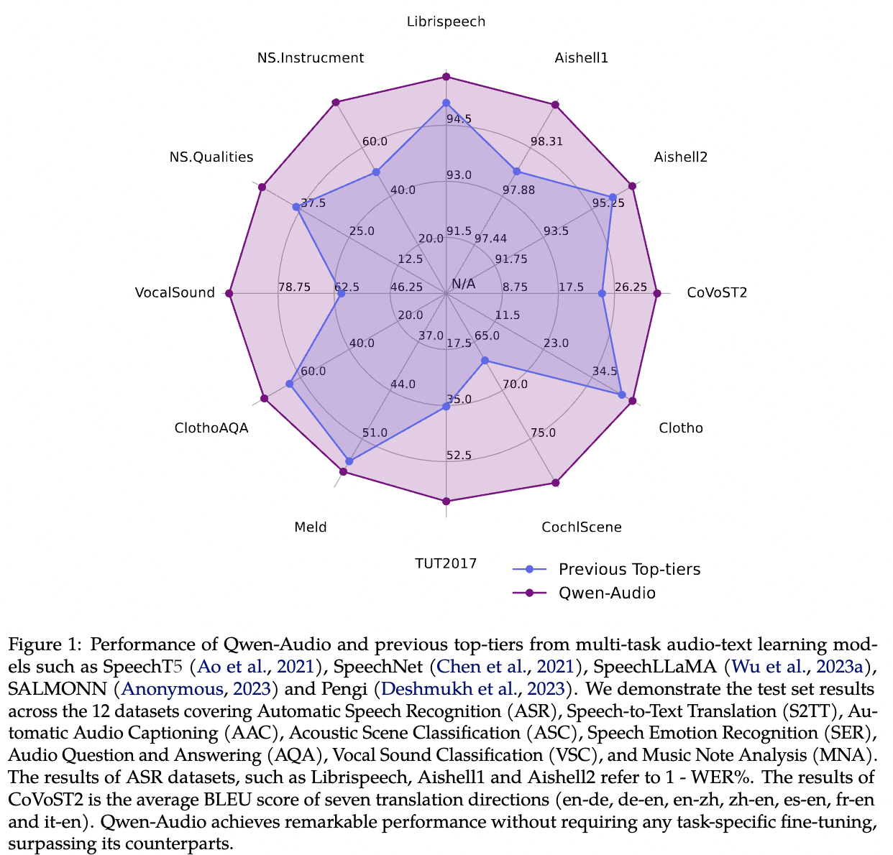

<p align="left">
        中文</a>&nbsp ｜ &nbsp<a href="README.md">English</a>
</p>
<br><br>

<p align="center">
    
<p>
<br>

<p align="center">
        Qwen-Audio <a href="https://www.modelscope.cn/models/qwen/QWen-Audio/summary">🤖 <a> | <a href="https://huggingface.co/Qwen/Qwen-Audio">🤗</a>&nbsp ｜ Qwen-Audio-Chat <a href="https://www.modelscope.cn/models/qwen/QWen-Audio-Chat/summary">🤖 <a>| <a href="https://huggingface.co/Qwen/Qwen-Audio-Chat">🤗</a>&nbsp | &nbsp&nbsp Demo<a href="https://modelscope.cn/studios/qwen/Qwen-Audio-Chat-Demo/summary"> 🤖</a> | <a href="https://huggingface.co/spaces/Qwen/Qwen-Audio">🤗</a>&nbsp
<br>
&nbsp&nbsp<a href="https://qwen-audio.github.io/Qwen-Audio/">Homepage</a>&nbsp ｜ &nbsp&nbsp<a href="http://arxiv.org/abs/2311.07919">Paper</a>&nbsp&nbsp | &nbsp&nbsp&nbsp<a href="https://github.com/QwenLM/Qwen/blob/main/assets/wechat.png">WeChat</a>&nbsp&nbsp | &nbsp&nbsp<a href="https://discord.gg/z3GAxXZ9Ce">Discord</a>&nbsp&nbsp</a>
</p>
<br><br>

[](https://paperswithcode.com/sota/speech-recognition-on-aishell-1?p=qwen-audio-advancing-universal-audio)
[](https://paperswithcode.com/sota/speech-recognition-on-aishell-2-test-android-1?p=qwen-audio-advancing-universal-audio)
[](https://paperswithcode.com/sota/speech-recognition-on-aishell-2-test-ios?p=qwen-audio-advancing-universal-audio)
[](https://paperswithcode.com/sota/speech-recognition-on-aishell-2-test-mic-1?p=qwen-audio-advancing-universal-audio)
[](https://paperswithcode.com/sota/acoustic-scene-classification-on-cochlscene?p=qwen-audio-advancing-universal-audio)
[](https://paperswithcode.com/sota/acoustic-scene-classification-on-tut-acoustic?p=qwen-audio-advancing-universal-audio)
[](https://paperswithcode.com/sota/audio-classification-on-vocalsound?p=qwen-audio-advancing-universal-audio) <br>
[](https://paperswithcode.com/sota/audio-captioning-on-clotho?p=qwen-audio-advancing-universal-audio) <br>
[](https://paperswithcode.com/sota/speech-recognition-on-librispeech-test-clean?p=qwen-audio-advancing-universal-audio)
[](https://paperswithcode.com/sota/emotion-recognition-in-conversation-on-meld?p=qwen-audio-advancing-universal-audio)
[](https://paperswithcode.com/sota/speech-recognition-on-librispeech-test-other?p=qwen-audio-advancing-universal-audio)

**Qwen-Audio** 是阿里云研发的大规模音频语言模型（Large Audio Language Model）。Qwen-Audio 可以以多种音频 (包括说话人语音、自然音、音乐、歌声）和文本作为输入，并以文本作为输出。Qwen-Audio 系列模型的特点包括：

- **音频基石模型**：Qwen-Audio是一个性能卓越的通用的音频理解模型，支持各种任务、语言和音频类型。在Qwen-Audio的基础上，我们通过指令微调开发了Qwen-Audio-Chat，支持多轮、多语言、多语言对话。Qwen-Audio和Qwen-Audio-Chat模型均已开源。
- **兼容多种复杂音频的多任务学习框架**：为了避免由于数据收集来源不同以及任务类型不同，带来的音频到文本的一对多的干扰问题，我们提出了一种多任务训练框架，实现相似任务的知识共享，并尽可能减少不同任务之间的干扰。通过提出的框架，Qwen-Audio可以容纳训练超过30多种不同的音频任务；
- **出色的性能**：Qwen-Audio在不需要任何任务特定的微调的情况下，在各种基准任务上取得了领先的结果。具体得，Qwen-Audio在Aishell1、cochlscene、ClothoAQA和VocalSound的测试集上都达到了SOTA；
- **支持多轮音频和文本对话，支持各种语音场景**：Qwen-Audio-Chat支持声音理解和推理、音乐欣赏、多音频分析、多轮音频-文本交错对话以及外部语音工具的使用。

<br>
<p align="center">
    
<p>
<br>


我们提供了 Qwen-Audio 系列的两个模型：
- Qwen-Audio: Qwen-Audio 以 [Qwen-7B](https://github.com/QwenLM/Qwen) 的预训练模型作为语言模型的初始化，并以 [Whisper-large-v2](https://github.com/openai/whisper) 作为音频编码器的初始化。
- Qwen-Audio-Chat: 在 Qwen-Audio 的基础上，我们使用对齐机制打造了基于大语言模型的语音AI助手Qwen-Audio-Chat，它支持更灵活的交互方式，包括多音频、多轮问答、创作等能力。
  <br>

## 新闻
* 2023.11.30 🔥 **Qwen-Audio**和**Qwen-Audio-Chat**的模型权重已经在Hugging Face和ModelScope开源。
* 2023.11.15 🎉 我们发布了Qwen-Audio系列模型的[论文](http://arxiv.org/abs/2311.07919), 介绍了相关的模型结构，训练方法和模型表现。
<br>

## 评测
我们在标准的12个学术数据集上评测了模型的能力

<p align="center">
    
<p>


综合评测结果如下：
<p align="center">
    
<p>


各项指标细节如下:
### 中英文语音识别（Automatic Speech Recognition）
英文语音识别
<table>
<thead>
<tr>
    <th rowspan="2">Dataset</th>
    <th rowspan="2">Model</th>
    <th colspan="4">Results (WER)</th>
  </tr>
<tr>
    <th>dev-clean</th>
    <th>dev-othoer</th>
    <th>test-clean</th>
    <th>test-other</th>
  </tr>
</thead>

<tbody align="center">
<tr>
    <td rowspan="5">Librispeech</td>
    <td>SpeechT5</td>
    <td>2.1</td>
    <td>5.5</td>
    <td>2.4</td>
    <td>5.8</td>
  </tr>
  <tr>
    <td>SpeechNet</td>
    <td>-</td>
    <td>-</td>
    <td>30.7</td>
    <td>-</td>
  </tr>
<tr>
    <td>SLM-FT</td>
    <td>-</td>
    <td>-</td>
    <td>2.6</td>
    <td>5.0</td>
  </tr>
<tr>
    <td>SALMONN</td>
    <td>-</td>
    <td>-</td>
    <td>2.1</td>
    <td>4.9</td>
  </tr>
<tr>
    <td>Qwen-Audio</td>
    <td><strong>1.8</strong></td>
    <td><strong>4.0</strong></td>
    <td><strong>2.0</strong></td>
    <td><strong>4.2</strong></td>
  </tr>
</table>

中文语音识别

<table>
<thead>
<tr>
    <th rowspan="2">Dataset</th>
    <th rowspan="2">Model</th>
    <th colspan="2">Results (WER)</th>
  </tr>
<tr>
    <th>dev</th>
    <th>test</th>
  </tr>
</thead>

<tbody align="center">
<tr>
    <td rowspan="4">Aishell1</td>
    <td>MMSpeech-base</td>
    <td>2.0</td>
    <td>2.1</td>
  </tr>
<tr>
    <td>MMSpeech-large</td>
    <td>1.6</td>
    <td>1.9</td>
  </tr>
<tr>
    <td>Paraformer-large</td>
    <td>-</td>
    <td>2.0</td>
  </tr>
<tr>
    <td>Qwen-Audio</td>
    <td><strong>1.2 (SOTA)</strong></td>
    <td><strong>1.3 (SOTA)</strong></td>
  </tr>
</table>


<table>
<thead>
<tr>
    <th rowspan="2">Dataset</th>
    <th rowspan="2">Model</th>
    <th colspan="3">Results (WER)</th>
  </tr>
<tr>
    <th>Mic</th>
    <th>iOS</th>
    <th>Android</th>
  </tr>
</thead>

<tbody align="center">
<tr>
    <td rowspan="3">Aishell2</td>
    <td>MMSpeech-base</td>
    <td>4.5</td>
    <td>3.9</td>
    <td>4.0</td>
  </tr>
<tr>
    <td>Paraformer-large</td>
    <td>-</td>
    <td><strong>2.9</strong></td>
    <td>-</td>
  </tr>
<tr>
    <td>Qwen-Audio</td>
    <td><strong>3.3</strong></td>
    <td>3.1</td>
    <td><strong>3.3</strong></td>
  </tr>
</table>

### 语音翻译（Soeech-to-text Translation）
<table>
<thead>
<tr>
    <th rowspan="2">Dataset</th>
    <th rowspan="2">Model</th>
    <th colspan="7">Results （BLUE)</th>
  </tr>
<tr>
    <th>en-de</th>
    <th>de-en</th>
    <th>en-zh</th>
    <th>zh-en</th>
    <th>es-en</th>
    <th>fr-en</th>
    <th>it-en</th>
  </tr>
</thead>

<tbody align="center">
<tr>
    <td rowspan="4">CoVoST2</td>
    <td>SALMMON</td>
    <td>18.6</td>
    <td>-</td>
    <td>33.1</td>
    <td>-</td>
    <td>-</td>
    <td>-</td>
    <td>-</td>
  </tr>
<tr>
    <td>SpeechLLaMA</td>
    <td>-</td>
    <td>27.1</td>
    <td>-</td>
    <td>12.3</td>
    <td>27.9</td>
    <td>25.2</td>
    <td>25.9</td>
  </tr>
<tr>
    <td>BLSP</td>
    <td>14.1</td>
    <td>-</td>
    <td>-</td>
    <td>-</td>
    <td>-</td>
    <td>-</td>
    <td>-</td>
  </tr>
<tr>
    <td>Qwen-Audio</td>
    <td><strong>25.1</strong></td>
    <td><strong>33.9</strong></td>
    <td><strong>41.5</strong></td>
    <td><strong>15.7</strong></td>
    <td><strong>39.7</strong></td>
    <td><strong>38.5</strong></td>
    <td><strong>36.0</strong></td>
  </tr>
</table>

### 语音标题生成（Automatic Audio Caption）
Clotho

<table>
<thead>
<tr>
    <th rowspan="2">Dataset</th>
    <th rowspan="2">Model</th>
    <th colspan="3">Results</th>
  </tr>
<tr>
    <th>CIDER</th>
    <th>SPICE</th>
    <th>SPIDEr</th>
  </tr>
</thead>

<tbody align="center">
<tr>
    <td rowspan="2">Clotho</td>
    <td>Pengi</td>
    <td>0.416</td>
    <td>0.126</td>
    <td>0.271</td>
  </tr>
<tr>
    <td>Qwen-Audio</td>
    <td><strong>0.441</strong></td>
    <td><strong>0.136</strong></td>
    <td><strong>0.288</strong></td>
  </tr>
</table>


### 带词级别时间戳的语音识别（Speech Recognition with Word-level Timestamp）
<table>
<thead>
<tr>
    <th rowspan="1">Dataset</th>
    <th rowspan="1">Model</th>
    <th colspan="1">AAC (ms)</th>
  </tr>
</thead>

<tbody align="center">
<tr>
    <td rowspan="3">Industrial Data</td>
    <td>Force-aligner</td>
    <td>60.3</td>
  </tr>
<tr>
    <td>Paraformer-large-TP</td>
    <td>65.3</td>
  </tr>
<tr>
    <td>Qwen-Audio</td>
    <td><strong>51.5 (SOTA)</strong></td>
  </tr>
</table>


### 音频场景分类（Automatic Scene Classification）
<table>
<thead>
<tr>
    <th rowspan="1">Dataset</th>
    <th rowspan="1">Model</th>
    <th colspan="1">ACC</th>
  </tr>
</thead>

<tbody align="center">
<tr>
    <td rowspan="2">Cochlscene</td>
    <td>Cochlscene</td>
    <td>0.669</td>
  </tr>
<tr>
    <td>Qwen-Audio</td>
    <td><strong>0.795 (SOTA)</strong></td>
  </tr>
<tr>
    <td rowspan="2">TUT2017</td>
    <td>Pengi</td>
    <td>0.353</td>
  </tr>
<tr>
    <td>Qwen-Audio</td>
    <td><strong>0.649</strong></td>
  </tr>
</table>


### 语音情绪识别（Speech Emotion Recognition）
<table>
<thead>
<tr>
    <th rowspan="1">Dataset</th>
    <th rowspan="1">Model</th>
    <th colspan="1">ACC</th>
  </tr>
</thead>

<tbody align="center">
<tr>
    <td rowspan="2">Meld</td>
    <td>WavLM-large</td>
    <td>0.542</td>
  </tr>
<tr>
    <td>Qwen-Audio</td>
    <td><strong>0.557</strong></td>
  </tr>
</table>


### 基于音频的问答（Audio Question & Answer）
ClothoAQA

<table>
<thead>
<tr>
    <th rowspan="2">Dataset</th>
    <th rowspan="2">Model</th>
    <th colspan="2">Results</th>
  </tr>
<tr>
    <th>ACC</th>
    <th>ACC (binary)</th>
  </tr>
</thead>

<tbody align="center">
<tr>
    <td rowspan="3">ClothoAQA</td>
    <td>ClothoAQA</td>
    <td>0.542</td>
    <td>0.627</td>
  </tr>
<tr>
    <td>Pengi</td>
    <td>-</td>
    <td>0.645</td>
  </tr>
<tr>
    <td>Qwen-Audio</td>
    <td><strong>0.579</strong></td>
    <td><strong>0.749</strong></td>
  </tr>
</table>

### 语音分类（Vocal Sound Classification）

<table>
<thead>
<tr>
    <th rowspan="1">Dataset</th>
    <th rowspan="1">Model</th>
    <th colspan="1">ACC</th>
  </tr>
</thead>

<tbody align="center">
<tr>
    <td rowspan="3">VocalSound</td>
    <td>CLAP</td>
    <td>0.4945</td>
  </tr>
<tr>
    <td>Pengi</td>
    <td>0.6035</td>
  </tr>
<tr>
    <td>Qwen-Audio</td>
    <td><strong>0.9289 (SOTA)</strong></td>
  </tr>
</table>


### 音符分析（Music Note Analysis）
<table>
<thead>
<tr>
    <th rowspan="1">Dataset</th>
    <th rowspan="1">Model</th>
    <th colspan="1">NS. Qualities (MAP)</th>
<th colspan="1">NS. Instrument (ACC)</th>
  </tr>
</thead>

<tbody align="center">
<tr>
    <td rowspan="2">NSynth</td>
    <td>Pengi</td>
    <td>0.3860</td>
    <td>0.5007</td>
  </tr>
<tr>
    <td>Qwen-Audio</td>
    <td><strong>0.4742</strong></td>
    <td><strong>0.7882</strong></td>
  </tr>
</table>

我们提供了以上**所有**评测脚本以供复现我们的实验结果。请阅读 [eval_audio/EVALUATION.md](eval_audio/EVALUATION.md) 了解更多信息。

### 闲聊能力测评

受限于学术领域缺乏系统性的Chat类的Audio模型的评测方法, 我们主要提供了演示案例[TUTORIAL](TUTORIAL_zh.md)和Demo供调用。Qwen-Audio-Chat可以被广泛用于语音识别，语音翻译，环境音理解，多音频理解，语音定位以及外部语音编辑模型调用等功能。


## 部署要求

* python 3.8及以上版本
* pytorch 1.12及以上版本，推荐2.0及以上版本
* 建议使用CUDA 11.4及以上（GPU用户需考虑此选项）
* FFmpeg
<br>
## 快速使用

我们提供简单的示例来说明如何利用 🤖 ModelScope 和 🤗 Transformers 快速使用 Qwen-Audio 和 Qwen-Audio-Chat。

在开始前，请确保你已经配置好环境并安装好相关的代码包。最重要的是，确保你满足上述要求，然后安装相关的依赖库。

```bash
pip install -r requirements.txt
```

接下来你可以开始使用Transformers或者ModelScope来使用我们的模型。关于更多用法，请参考[教程](TUTORIAL_zh.md)。目前Qwen-Audio以及Qwen-Audio-Chat模型处理30秒以内的音频表现更佳。

#### 🤗 Transformers

如希望使用 Qwen-Audio-Chat 进行推理，所需要写的只是如下所示的数行代码。**请确保你使用的是最新代码。**

```python
from transformers import AutoModelForCausalLM, AutoTokenizer
from transformers.generation import GenerationConfig
import torch
torch.manual_seed(1234)

# 请注意：分词器默认行为已更改为默认关闭特殊token攻击防护。
tokenizer = AutoTokenizer.from_pretrained("Qwen/Qwen-Audio-Chat", trust_remote_code=True)

# 打开bf16精度，A100、H100、RTX3060、RTX3070等显卡建议启用以节省显存
# model = AutoModelForCausalLM.from_pretrained("Qwen/Qwen-Audio-Chat", device_map="auto", trust_remote_code=True, bf16=True).eval()
# 打开fp16精度，V100、P100、T4等显卡建议启用以节省显存
# model = AutoModelForCausalLM.from_pretrained("Qwen/Qwen-Audio-Chat", device_map="auto", trust_remote_code=True, fp16=True).eval()
# 使用CPU进行推理，需要约32GB内存
# model = AutoModelForCausalLM.from_pretrained("Qwen/Qwen-Audio-Chat", device_map="cpu", trust_remote_code=True).eval()
# 默认gpu进行推理，需要约24GB显存
model = AutoModelForCausalLM.from_pretrained("Qwen/Qwen-Audio-Chat", device_map="cuda", trust_remote_code=True).eval()

# 可指定不同的生成长度、top_p等相关超参（transformers 4.32.0及以上无需执行此操作）
# model.generation_config = GenerationConfig.from_pretrained("Qwen/Qwen-Audio-Chat", trust_remote_code=True)

# 第一轮对话
query = tokenizer.from_list_format([
    {'audio': 'assets/audio/1272-128104-0000.flac'}, # Either a local path or an url
    {'text': 'what does the person say?'},
])
response, history = model.chat(tokenizer, query=query, history=None)
print(response)
# The person says: "mister quilter is the apostle of the middle classes and we are glad to welcome his gospel".

# 第二轮对话
response, history = model.chat(tokenizer, 'Find the start time and end time of the word "middle classes"', history=history)
print(response)
# The word "middle classes" starts at <|2.33|> seconds and ends at <|3.26|> seconds.

```


运行Qwen-Audio同样非常简单。

<summary>运行Qwen-Audio</summary>

```python
from transformers import AutoModelForCausalLM, AutoTokenizer
from transformers.generation import GenerationConfig
import torch
torch.manual_seed(1234)

tokenizer = AutoTokenizer.from_pretrained("Qwen/Qwen-Audio", trust_remote_code=True)

# 打开bf16精度，A100、H100、RTX3060、RTX3070等显卡建议启用以节省显存
# model = AutoModelForCausalLM.from_pretrained("Qwen/Qwen-Audio", device_map="auto", trust_remote_code=True, bf16=True).eval()
# 打开fp16精度，V100、P100、T4等显卡建议启用以节省显存
# model = AutoModelForCausalLM.from_pretrained("Qwen/Qwen-Audio", device_map="auto", trust_remote_code=True, fp16=True).eval()
# 使用CPU进行推理，需要约32GB内存
# model = AutoModelForCausalLM.from_pretrained("Qwen/Qwen-Audio", device_map="cpu", trust_remote_code=True).eval()
# 默认gpu进行推理，需要约24GB显存
model = AutoModelForCausalLM.from_pretrained("Qwen/Qwen-Audio", device_map="cuda", trust_remote_code=True).eval()

# 可指定不同的生成长度、top_p等相关超参（transformers 4.32.0及以上无需执行此操作）
# model.generation_config = GenerationConfig.from_pretrained("Qwen/Qwen-Audio", trust_remote_code=True)
audio_url = "assets/audio/1272-128104-0000.flac"
sp_prompt = "<|startoftranscription|><|en|><|transcribe|><|en|><|notimestamps|><|wo_itn|>"
query = f"<audio>{audio_url}</audio>{sp_prompt}"
audio_info = tokenizer.process_audio(query)
inputs = tokenizer(query, return_tensors='pt', audio_info=audio_info)
inputs = inputs.to(model.device)
pred = model.generate(**inputs, audio_info=audio_info)
response = tokenizer.decode(pred.cpu()[0], skip_special_tokens=False,audio_info=audio_info)
print(response)
# <audio>assets/audio/1272-128104-0000.flac</audio><|startoftranscription|><|en|><|transcribe|><|en|><|notimestamps|><|wo_itn|>mister quilting is the apostle of the middle classes and we are glad to welcome his gospel<|endoftext|>
# 
```


若在使用上述代码时由于各种原因无法从 Hugging Face 拉取模型和代码，可以先从 ModelScope 下载模型及代码至本地，再从本地加载模型：

```python
from modelscope import snapshot_download
from transformers import AutoModelForCausalLM, AutoTokenizer

# Downloading model checkpoint to a local dir model_dir
model_id = 'qwen/Qwen-Audio-Chat'
revision = 'master'
model_dir = snapshot_download(model_id, revision=revision)

# Loading local checkpoints
# trust_remote_code is still set as True since we still load codes from local dir instead of transformers
tokenizer = AutoTokenizer.from_pretrained(model_dir, trust_remote_code=True)
model = AutoModelForCausalLM.from_pretrained(
    model_dir,
    device_map="cuda",
    trust_remote_code=True
).eval()
```

#### 🤖 ModelScope

魔搭（ModelScope）是开源的模型即服务共享平台，为泛AI开发者提供灵活、易用、低成本的一站式模型服务产品。使用ModelScope同样非常简单，代码如下所示：

```python
from modelscope import (
    snapshot_download, AutoModelForCausalLM, AutoTokenizer, GenerationConfig
)
import torch
model_id = 'qwen/Qwen-Audio-Chat'
revision = 'master'

model_dir = snapshot_download(model_id, revision=revision)
torch.manual_seed(1234)

tokenizer = AutoTokenizer.from_pretrained(model_dir, trust_remote_code=True)
if not hasattr(tokenizer, 'model_dir'):
    tokenizer.model_dir = model_dir
# 打开bf16精度，A100、H100、RTX3060、RTX3070等显卡建议启用以节省显存
# model = AutoModelForCausalLM.from_pretrained(model_dir, device_map="auto", trust_remote_code=True, bf16=True).eval()
# 打开fp16精度，V100、P100、T4等显卡建议启用以节省显存
# model = AutoModelForCausalLM.from_pretrained(model_dir, device_map="auto", trust_remote_code=True, fp16=True).eval()
# 使用CPU进行推理，需要约32GB内存
# model = AutoModelForCausalLM.from_pretrained(model_dir, device_map="cpu", trust_remote_code=True).eval()
# 默认gpu进行推理，需要约24GB显存
model = AutoModelForCausalLM.from_pretrained(model_dir, device_map="auto", trust_remote_code=True).eval()

# 第一轮对话
query = tokenizer.from_list_format([
    {'audio': 'assets/audio/1272-128104-0000.flac'}, # Either a local path or an url
    {'text': 'what does the person say?'},
])
response, history = model.chat(tokenizer, query=query, history=None)
print(response)
# The person says: "mister quilter is the apostle of the middle classes and we are glad to welcome his gospel".

# 第二轮对话
response, history = model.chat(tokenizer, 'Find the start time and end time of the word "middle classes"', history=history)
print(response)
# The word "middle classes" starts at <|2.33|> seconds and ends at <|3.26|> seconds.
```

<br>

## Demo

### Web UI

我们提供了Web UI的demo供用户使用。在开始前，确保已经安装如下代码库：

```
pip install -r requirements_web_demo.txt
```

随后运行如下命令，并点击生成链接：

```
python web_demo_audio.py
```

<br>

## FAQ

如遇到问题，敬请查阅 [FAQ](FAQ_zh.md)以及issue区，如仍无法解决再提交issue。
<br>


## 团队招聘

我们是通义千问语音多模态团队，致力于以通义千问为核心，拓展音频多模态理解和生成能力，实现自由灵活的音频交互。目前团队蓬勃发展中，如有意向实习或全职加入我们，请发送简历至qwen_audio@list.alibaba-inc.com.
<br>

## 使用协议

研究人员与开发者可使用Qwen-Audio和Qwen-Audio-Chat或进行二次开发。我们同样允许商业使用，具体细节请查看[LICENSE](LICENSE)。如需商用，请填写[问卷](https://dashscope.console.aliyun.com/openModelApply/qianwen)申请。
<br>

## 联系我们

如果你想给我们的研发团队和产品团队留言，请通过邮件（qianwen_opensource@alibabacloud.com）联系我们。
<br>


## 引用

如果你觉得我们的论文和代码对你的研究有帮助，请考虑:star: 和引用 :pencil: :)

```BibTeX
@article{Qwen-Audio,
  title={Qwen-Audio: Advancing Universal Audio Understanding via Unified Large-Scale Audio-Language Models},
  author={Chu, Yunfei and Xu, Jin and Zhou, Xiaohuan and Yang, Qian and Zhang, Shiliang and Yan, Zhijie  and Zhou, Chang and Zhou, Jingren},
  journal={arXiv preprint arXiv:2311.07919},
  year={2023}
}
```
